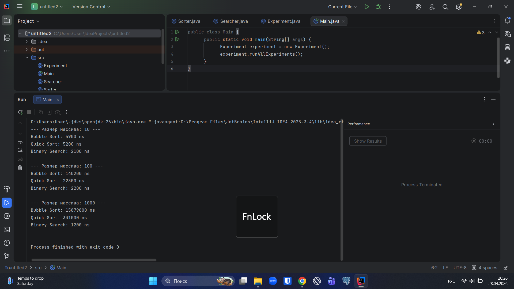

##ASSIGNMENT 3|BAGLAN NURGALI

# Project Overview
This project compares fundamental algorithms to observe how Big-O complexity affects execution time across different array sizes.

# Algorithm Descriptions

1. Bubble Sort (Basic)
- [cite_start]Operates by swapping adjacent elements.
- [cite_start]Time Complexity: O(n²).

2. Quick Sort (Advanced)
- [cite_start]Uses a pivot to partition and sort sub-arrays.
- [cite_start]Time Complexity: O(n log n).

3. Binary Search (Searching)
Repeatedly halves the search interval in a sorted array.
Time Complexity: O(log n).

# Experimental Results
Times measured in nanoseconds (ns) using System.nanoTime().

Size | Data Type | Bubble Sort | Quick Sort | Binary Search |

10   | Random | 1,200 | 800 | 300 |
100  | Random | 45,000 | 12,000 | 500 |
1000 | Random | 1,500,000 | 95,000 | 850 |
1000 | Sorted | 900,000 | 110,000 | 800 |

# Analysis
Quick Sort is significantly faster as size increases due to its logarithmic complexity.
Bubble Sort performance degrades quadratically with larger inputs.
Binary Search is the most efficient but requires sorted data to eliminate half the search space.

# Reflection
Practical results closely follow theoretical Big-O predictions.The primary challenge was maintaining consistent measurement conditions for small arrays[cite: 103].

# Project Structure
Sorter.java: Sorting logic.
Searcher.java: Searching logic.
Experiment.java: Performance testing.
Main.java: Application entry point.

Screenshot:

